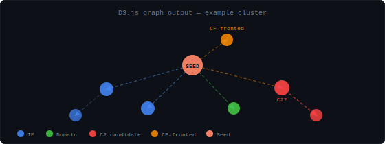

<div align="center">


<br/>


</div>

---

I built this after spending too many nights manually pivoting through threat infrastructure and thinking *"there has to be a better way."*

The short version: you give it an IP, a domain, or a file hash. It fans out across BGP routing tables, TLS certificate logs, passive DNS, and malware databases — and comes back with a cluster map of the infrastructure behind it. Think of it as the methodology in the [Hunt.io APT reports](https://hunt.io/blog) but automated and queryable from your terminal.

No magic. Just chaining public data sources that most people look at in isolation.

---

## How the pivot chain works

Every piece of attacker infrastructure leaves traces across multiple independent data sources. A C2 server has a TLS cert. That cert has SANs. Those SANs resolve to IPs. Those IPs share BGP prefixes. Those prefixes have RPKI records. And so on.

<div align="center">

</div>

Each source feeds into the next. A domain found in a TLS cert gets BGP-checked. An IP found in BGP gets RPKI-validated. A hash from an open directory gets pivoted through malware databases. The graph keeps growing until you hit `max_depth`.

---

## The techniques, one by one

### 1. TLS Certificate SAN Pivoting

This is probably the most powerful single technique for mapping APT infrastructure.

When an attacker sets up a C2 server, they often reuse the same TLS certificate — or at minimum use the same CA, same key size, same Subject field pattern — across multiple servers. The **Subject Alternative Name (SAN)** field lists every domain the cert is valid for. Find one, the cert often reveals five more.

The approach:
1. Connect to the target on port 443, grab the live certificate
2. Extract all SANs
3. Query [crt.sh](https://crt.sh) for cert history of each SAN — reveals domains that shared certs historically, even after rotation
4. Resolve each discovered domain — Cloudflare IP means C2 is hidden, direct IP means you found it
5. Queue everything for the next depth

```
185.215.113.5 ──[TLS cert]──▶ SAN: c2panel.example.com
                                    update-service.net
                                    telemetry-cdn.com
                              └──[crt.sh history]──▶ 3 more domains from 2023
                                                      └──[DNS resolve]──▶ 3 new IPs
```

The key insight: **a Cloudflare IP in DNS ≠ attacker infrastructure**. When a domain resolves to CF, the real backend is hidden behind it. When it resolves to a non-CF IP, that's your target. This technique is documented in public reports against [MuddyWater](https://www.microsoft.com/en-us/security/blog/2022/08/25/mercury-leveraging-log4j-2-vulnerabilities-in-unpatched-systems-to-target-israeli-organizations/) and [APT29](https://www.mandiant.com/resources/blog/apt29-continues-targeting-microsoft).

---

### 2. BGP Route Analysis

BGP was designed for trust, not security. That makes it a surprisingly rich source of threat intelligence.

**Prefix churn** — Legitimate networks announce prefixes and leave them alone. Malicious infrastructure tends to announce, use, withdraw, move. High churn = suspicious. I pull this from [RIPEstat BGP updates](https://stat.ripe.net/docs/data_api).

**MOAS (Multiple Origin AS)** — A prefix announced by two different ASNs simultaneously. Classic BGP hijack indicator — someone routing traffic through their own ASN to intercept before the real destination. RPKI tells you which origin is legitimate.

**Multi-vantage-point consistency** — A prefix that looks different from Tokyo vs. Frankfurt vs. São Paulo is suspicious. I use [RIPE RIS collectors](https://ris.ripe.net/).

<div align="center">

</div>

High-frequency announce/withdraw cycles are a strong signal. Real CDNs and ISPs don't do this.

---

### 3. RPKI Validation

[RPKI](https://rpki.cloudflare.com/) lets ASN holders publish Route Origin Authorizations — cryptographic statements saying *"prefix X may only be announced by ASN Y."*

`RPKI INVALID` = someone announcing a prefix from an ASN with no authorization. Could be a hijack, a misconfiguration, or a stale ROA. The combination of `INVALID + high churn + MOAS` is a strong hijack signal.

I cross-validate with both [Cloudflare RPKI](https://rpki.cloudflare.com/) and [RIPEstat](https://stat.ripe.net/docs/data_api) — they sometimes disagree, and the disagreement itself is interesting.

```
Prefix:          185.215.113.0/24
Expected origin: AS206349
Cloudflare RPKI: INVALID  ◀── no ROA covers this announcement
RIPEstat RPKI:   INVALID
MOAS:            AS44901 also announcing this prefix
Verdict:         HIGH CONFIDENCE HIJACK
```

---

### 4. Open Directory Scanning

Almost embarrassingly simple, but alarmingly productive.

Threat actors set up web servers to stage payloads. They frequently leave directory listing enabled — either by accident or because they don't care. An exposed `/files/` on a C2 server is basically an open evidence locker.

What I look for:
- Apache/Nginx directory listing signatures in HTTP responses
- Suspicious extensions in the listing: `.exe`, `.ps1`, `.sh`, `.elf`, `.dll`, `.bin`
- Known malware toolkit naming patterns
- Common staging paths: `/tools/`, `/staging/`, `/upload/`, `/tmp/`, `/data/`

When I find a listing, I extract file URLs, download samples, compute hashes, then pivot those through MalwareBazaar and ThreatFox to check if they're known. This technique was used publicly to track [MuddyWater staging servers](https://blogs.blackberry.com/en/2022/10/mustang-panda-abuses-legitimate-apps-to-target-myanmar-based-targets) and is described in [Recorded Future's methodology](https://www.recordedfuture.com/threat-intelligence-101).

---

### 5. APT Actor Infrastructure Mapping

The real value is running all four techniques **recursively**, starting from published actor IOCs and letting the graph grow.

I maintain a small seed database aggregated from public threat reports (Mandiant, MSTIC, Recorded Future, abuse.ch). The seeded IPs, domains, and hashes are just starting points — the engine fans out from there:

```
Actor: MuddyWater
Seeds: 5 IPs · 4 domains · 0 hashes · 2 ASNs
       │
       ├─[depth 0]─ TLS pivot on seed IPs ──────▶ 12 new domains
       │            BGP analysis on seed ASNs ──▶ 8 sample IPs
       │
       ├─[depth 1]─ TLS pivot on new domains ──▶ 6 more IPs
       │            Open dir scan ──────────────▶ 2 open listings, 4 artifacts
       │
       └─[depth 2]─ Hash pivot on artifacts ───▶ 3 related C2 IPs
                    BGP clustering ─────────────▶ 2 ASN clusters confirmed
```

By depth 2 you typically have a fairly complete picture of the cluster. Anything sharing BGP space, TLS cert history, or artifact hashes is almost certainly operated by the same actor.

---

## Output formats

Results are exported as:
- **JSON** — full graph for ingestion into SIEM / Elastic / Splunk
- **STIX 2.1** — standard format, works with MISP / OpenCTI
- **HTML** — interactive D3.js force-directed graph, click any node to inspect

<div align="center">

</div>

---

## Data sources

All free, all public — no scrapers, no unauthorized access.

| Source | What I use it for |
|--------|-------------------|
| [RIPEstat](https://stat.ripe.net/docs/data_api) | BGP routing, prefix history, BGP updates |
| [Cloudflare RPKI](https://rpki.cloudflare.com/) | Route origin validation |
| [crt.sh](https://crt.sh/) | Certificate transparency historical data |
| [MalwareBazaar](https://bazaar.abuse.ch/) | File hash → malware family lookup |
| [ThreatFox](https://threatfox.abuse.ch/) | IOC pivot — hash → hosting infrastructure |
| [Spamhaus DROP/ASN](https://www.spamhaus.org/drop/) | Known malicious network lists |
| [Feodo Tracker](https://feodotracker.abuse.ch/) | Banking trojan C2 IPs |
| [FireHOL](https://iplists.firehol.org/) | Aggregated IP blocklists |
| [AbuseIPDB](https://www.abuseipdb.com/) | Community abuse reports |
| [GreyNoise](https://www.greynoise.io/) | Scanner vs. targeted attacker classification |
| [OTX AlienVault](https://otx.alienvault.com/) | Threat pulses, correlated IOCs |
| [CIRCL Passive DNS](https://www.circl.lu/services/passive-dns/) | Historical DNS resolution data |
| [CAIDA AS-Rank](https://asrank.caida.org/) | AS relationship topology |
| [Shodan](https://shodan.io/) | Port banners, JA3 fingerprints, CVE exposure |
| [VirusTotal](https://www.virustotal.com/) | Multi-engine analysis, graph pivoting |

---

## MITRE ATT&CK coverage

| Technique | ID | What this maps to |
|-----------|-----|-------------------|
| Acquire Infrastructure | [T1583](https://attack.mitre.org/techniques/T1583/) | New ASN registrations, fresh prefix announcements |
| Compromise Infrastructure | [T1584](https://attack.mitre.org/techniques/T1584/) | RPKI INVALID on existing legitimate prefixes |
| Stage Capabilities | [T1608](https://attack.mitre.org/techniques/T1608/) | Open directory staging servers |
| Obtain Capabilities | [T1588](https://attack.mitre.org/techniques/T1588/) | Shared tooling across infrastructure |
| Web Service as C2 | [T1102](https://attack.mitre.org/techniques/T1102/) | Cloudflare-fronted C2 domains |
| Non-Standard Port | [T1571](https://attack.mitre.org/techniques/T1571/) | Port profile anomaly scoring |
| Domain Generation | [T1568](https://attack.mitre.org/techniques/T1568/) | Certificate pattern analysis |

---

## Further reading

The methodology here is not original — I connected pieces that others documented better than I could. These are the posts that shaped how I think about this:

- [Hunt.io — Hunting APT Infrastructure](https://hunt.io/blog) — the best public writing on this topic, period
- [Recorded Future — Infrastructure Tracking Methodology](https://www.recordedfuture.com/threat-intelligence-101)
- [Censys — How Attackers Hide C2 Infrastructure](https://censys.com/how-attackers-hide-c2-infrastructure/)
- [Mandiant — APT29 Infrastructure Analysis](https://www.mandiant.com/resources/blog/apt29-continues-targeting-microsoft)
- [RIPE NCC — RPKI FAQ](https://www.ripe.net/manage-ips-and-asns/resource-management/rpki/)
- [Cloudflare — Is BGP safe yet?](https://isbgpsafeyet.com/)
- [Feike Hacquebord — Two Years of Pawn Storm](https://documents.trendmicro.com/assets/wp/wp-two-years-of-pawn-storm.pdf)

---

## Requirements

```bash
pip install requests
pip install dnspython   # recommended — better DNS resolution
pip install rich        # optional   — colored terminal output
```

No API keys required for basic functionality. Shodan and VirusTotal keys unlock additional enrichment.

---

<div align="center">
<sub>Built for defensive threat intelligence research. All data sources are public APIs.</sub>
</div>
